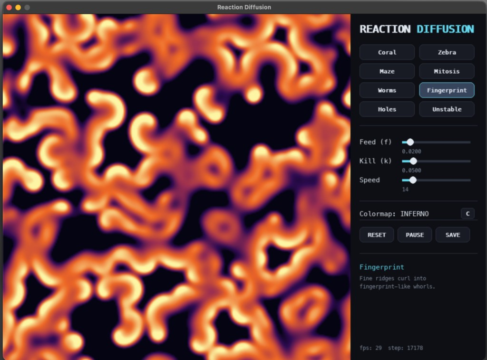

# Turing Patterns

An interactive reaction-diffusion playground built with Python, Pygame, and NumPy.

You do not need to know the math to enjoy it. Open the app, choose a preset, drag on the canvas, and watch tiny chemical rules grow into coral, stripes, mazes, fingerprints, and other organic-looking patterns.

## What Am I Looking At?

This app simulates two imaginary chemicals spreading across a square surface.

One chemical feeds the pattern. The other chemical removes or changes it. At every moment, each pixel looks at its neighbors and updates itself. That simple local rule creates surprisingly rich shapes, similar to things we see in nature:

- animal stripes and spots
- coral-like growth
- fingerprints
- cell-like blobs
- branching mazes

These kinds of patterns are often called Turing patterns, after Alan Turing, who studied how simple chemical processes could create natural forms.

## How To Run

Install the dependencies and start the app:

```bash
uv run python main.py
```

The window has a large simulation area on the left and controls on the right.

## Controls

- Drag the mouse on the pattern to paint new chemical into the simulation.
- Press `Space` to pause or resume.
- Press `R` to reset the current preset.
- Press `C` to cycle colors.
- Press `S` to save a screenshot.
- Press `1` through `8` to jump between presets.
- Press `+` or `-` to change the simulation speed.

## Presets

The preset buttons are starting points. Each one uses slightly different settings, so the same simple rules grow into different worlds:

- Coral
- Zebra
- Maze
- Mitosis
- Worms
- Fingerprint
- Holes
- Unstable

The `Feed` and `Kill` sliders change the behavior live. Small adjustments can completely change the pattern, so try moving them slowly and watching the transition.

## Screenshots



Press `S` to save the current canvas as a PNG in the `screenshots/` folder.

The app saves new screenshots locally so you can collect your favorite moments while exploring presets and painting into the simulation.
